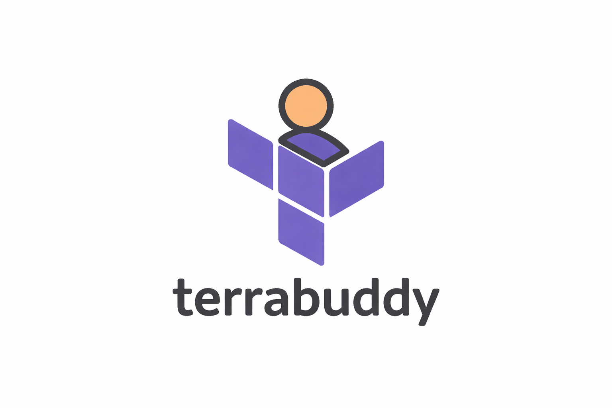

# terra-buddy


>Opinionated CLI to help you scaffold projects with terraform for AWS.

The goal of this tool is to help create/start a project from scratch with a number of decisions about technology and structure, so it is heavily opinionated. Some of the decisions:
- AWS is the cloud provider (maybe extendable in the future to other vendors)
- Terraform is the IaC language
- The terraform state is stored remotely in the provider itself in a S3 bucket (not locally)
- It comes with Zod as serialiser. When its a serverless project, Zod defines the request objects received in the gateway and that also compiles into the TS objects used in the lambdas, and finally it connects with the OpenAPI (Swagger)


# Instructions
This is a npm package. If you want to clone the repository and use it locally without installing it from the npm repos you can:
```
pnpm run build
npm link
```